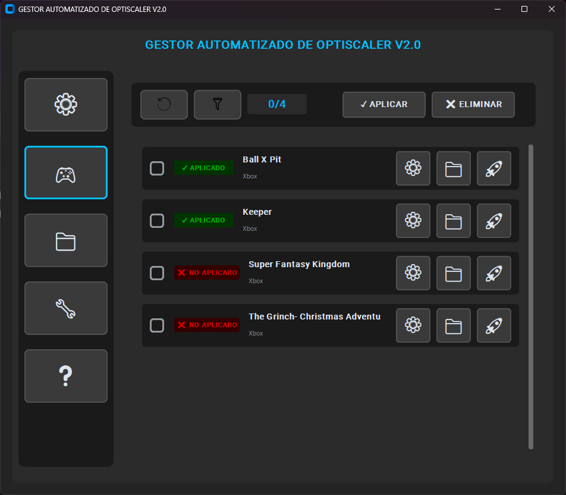

# 🎮 OptiScaler Manager


[](https://github.com/Bigflood92/OptiScaler-Manager/actions)
[](https://github.com/Bigflood92/OptiScaler-Manager/releases)
[](https://github.com/Bigflood92/OptiScaler-Manager)

**Gestor automatizado de OptiScaler** - Herramienta gráfica avanzada para inyectar FSR 3.1/4.0 (AMD FidelityFX Super Resolution), XeSS y DLSS en juegos compatibles mediante OptiScaler.

---

## 📸 Capturas de Pantalla

### Interfaz Principal (Modo Clásico)
<div align="center">
  
  <p><em>Vista principal con lista de juegos detectados y configuración de mods</em></p>
</div>

### Modo Gaming (Navegación por Mando)
<div align="center">
  
  <p><em>Interfaz optimizada para navegación con mando Xbox/PlayStation</em></p>
</div>

### Descarga de Mods
<div align="center">
  
  <p><em>Gestor de versiones de OptiScaler con descarga desde GitHub</em></p>
</div>

### Configuración de Juego
<div align="center">
  
  <p><em>Configuración individual por juego con presets disponibles</em></p>
</div>

---

## ✨ Características

### 🎨 Interfaz Dual
- **Interfaz Clásica**: Vista tradicional de pestañas para configuración detallada
- **Interfaz Gaming**: Diseño optimizado para navegación con mando (En proceso)(Xbox/PlayStation)
  - Navegación completa con D-Pad y botones
  - Indicadores visuales de foco (bordes de colores)
  - Panel lateral de navegación
  - Soporte táctil en dispositivos compatibles

### 🎯 Gestión de Mods
- **Detección automática** de juegos en Steam, Epic Games, Xbox Game Pass, GOG
- **Instalación/desinstalación masiva** en juegos seleccionados
- **Configuración individual** por juego
- **Sistema de caché** para detección rápida de juegos
- **Presets rápidos**: Default, Performance, Balanced, Quality, Custom

### ⚙️ Configuración Avanzada
- **GPU**: AMD/Intel o NVIDIA
- **DLL de inyección**: dxgi.dll, d3d11.dll, d3d12.dll, dinput8.dll, winmm.dll
- **Frame Generation**: Automático, Activado, Desactivado
- **Upscaler**: FSR 3.1, FSR 4.0, XeSS, DLSS, Automático
- **Modo de reescalado**: Performance, Balanced, Quality, Ultra Performance, Native AA, Automático
- **Sharpness**: Control deslizante 0.0 - 1.0
- **Extras**: Overlay debug, Motion Blur

### 📦 Gestión de Versiones
- **Descarga automática** de versiones de OptiScaler desde GitHub
- **Instalación directa** desde el gestor
- **Caché de versiones** para trabajo offline
- **Actualización automática** cada 24h

---

## 📥 Instalación

### Ejecutable (Usuario Final)

**[📦 Descargar última versión](https://github.com/Bigflood92/OptiScaler-Manager/releases/latest)**

1. Descarga `Gestor optiscaler V2.0.exe` desde la página de releases
2. Ejecuta como **administrador**
3. ¡Listo para usar!

> **Nota**: El ejecutable no está firmado digitalmente. Es seguro, solo acepta el aviso UAC de Windows.

### Desde Código Fuente (Desarrolladores)

#### Requisitos
- Windows 10/11 x64
- Python 3.12 (recomendado - Python 3.13 tiene bugs conocidos)
- Permisos de administrador

#### Instalación

```powershell
# Clonar repositorio
git clone https://github.com/Bigflood92/OptiScaler-Manager.git
cd OptiScaler-Manager

# Crear entorno virtual con Python 3.12
py -3.12 -m venv .venv312

# Activar entorno
.\.venv312\Scripts\Activate.ps1

# Instalar dependencias
pip install -r requirements.txt

# Ejecutar aplicación
python -m src.main
```

---

## 🚀 Uso

### Primera Ejecución

1. Ejecuta `Gestor optiscaler V2.0.exe` como **administrador**
2. Ve a **Ajustes de la App** → **Carpetas Personalizadas**
3. Añade rutas donde tienes juegos instalados (ej: `D:\Juegos`)
4. Pulsa **🔍 Escanear** para detectar juegos

### Instalar Mod en Juegos

1. En **Juegos Detectados**, marca los juegos deseados con checkbox
2. Configura opciones en **Configuración del Mod** o usa un **Preset**
3. Pulsa **✅ APLICAR A SELECCIONADOS**

### Gestión de Versiones

1. Ve a **Ajustes de la App** → **Descargar Mods**
2. Selecciona la versión de OptiScaler deseada
3. Pulsa **Descargar y Seleccionar**
4. La versión descargada se aplicará a futuros mods

### Navegación con Mando

#### Menú Lateral
- **↑↓**: Cambiar entre secciones
- **→**: Entrar al panel activo

#### Panel de Configuración
- **↑↓**: Navegar entre opciones
- **←→**: Cambiar valores (Presets, GPU, Sharpness)
- **A/Enter**: Activar desplegables y botones
- **B/Esc**: Cancelar o volver al menú

#### Panel de Juegos
- **↑↓**: Navegar entre juegos
- **A**: Seleccionar/deseleccionar juego
- **Botón verde 🎮**: Cambiar a interfaz clásica

---

## 🔧 Presets Disponibles

| Preset | Upscaler | Frame Gen | Modo Escalado | Nitidez |
|--------|----------|-----------|---------------|---------|
| **Default** | Automático | Automático | Automático | 0.8 |
| **Performance** | FSR 3.1 | Activado | Performance | 0.5 |
| **Balanced** | FSR 3.1 | Activado | Balanced | 0.7 |
| **Quality** | XeSS | Desactivado | Quality | 0.9 |
| **Custom** | - | - | - | - |

---

## 📁 Estructura del Proyecto

```
OptiScaler-Manager/
├── src/                    # Código fuente modular
│   ├── main.py            # Punto de entrada principal
│   ├── core/              # Lógica de negocio
│   │   ├── scanner.py     # Detección de juegos
│   │   ├── installer.py   # Instalación de mods
│   │   ├── config_manager.py  # Gestión de configuración
│   │   └── utils.py       # Utilidades comunes
│   ├── gui/               # Interfaz gráfica
│   │   ├── legacy_app.py  # GUI original migrada
│   │   └── legacy_adapter.py  # Adaptador de compatibilidad
│   └── config/            # Configuración y constantes
│       └── settings.py
├── Config Optiscaler Gestor/  # Configuración de usuario
│   ├── mod_source/        # Versiones descargadas de OptiScaler
│   ├── games_cache.json   # Caché de juegos detectados
│   └── injector_config.json  # Configuración de la aplicación
├── requirements.txt       # Dependencias Python
├── Gestor optiscaler V2.0.spec  # Configuración PyInstaller
└── run.ps1                # Script de arranque
```

---

## 🛠️ Desarrollo

### Compilar Ejecutable

```powershell
# Activar entorno virtual
.\.venv312\Scripts\Activate.ps1

# Compilar con PyInstaller
pyinstaller --noconfirm "Gestor optiscaler V2.0.spec"

# El ejecutable estará en: dist/Gestor optiscaler V2.0.exe
```

### Ejecutar Tests

```powershell
pytest tests/
```

---

## 🐛 Solución de Problemas

### No se detectan juegos
1. Verifica que los juegos estén instalados en las rutas estándar
2. Añade carpetas personalizadas en **Configuración de la App**
3. Usa **Ruta Manual** para juegos específicos

### El mod no funciona en un juego
1. Verifica que el juego sea compatible con DLSS/FSR
2. Prueba con diferentes DLLs de inyección
3. Consulta el archivo `gestor_optiscaler_log.txt` para detalles

### Error: "No module named 'customtkinter'"
**Causa**: Dependencias no instaladas en el entorno virtual

**Solución**:
```powershell
.\.venv312\Scripts\pip install -r requirements.txt
```

---

## 📄 Licencia

**MIT License** - © 2025 Jorge Coronas

Se concede permiso para usar, copiar, modificar, fusionar, publicar, distribuir, sublicenciar y/o vender copias del Software, sujeto a las condiciones de la licencia MIT completa.

Ver [LICENSE](LICENSE) para más detalles.

---

## 🙏 Créditos

- **[OptiScaler](https://github.com/cdozdil/OptiScaler)** - Por el increíble mod que hace posible FSR3/XeSS en juegos DLSS
- **[CustomTkinter](https://github.com/TomSchimansky/CustomTkinter)** - Por la moderna biblioteca de UI
- Comunidad de modding de PC Gaming

---

## 🤝 Contribuciones

¡Las contribuciones son bienvenidas! Por favor:

1. Lee la [Guía de Contribución](CONTRIBUTING.md)
2. Fork el proyecto
3. Crea una rama para tu feature (`git checkout -b feature/AmazingFeature`)
4. Commit tus cambios (`git commit -m 'Add: Amazing Feature'`)
5. Push a la rama (`git push origin feature/AmazingFeature`)
6. Abre un Pull Request

Ver [CHANGELOG.md](CHANGELOG.md) para el historial de cambios del proyecto.

---

## 📞 Contacto

**Jorge Coronas** - Creador y mantenedor principal

- GitHub: [@Bigflood92](https://github.com/Bigflood92)
- Repositorio: [OptiScaler-Manager](https://github.com/Bigflood92/OptiScaler-Manager)

---

<p align="center">
  <sub>Hecho con ❤️ para la comunidad de gaming en PC</sub>
</p>
