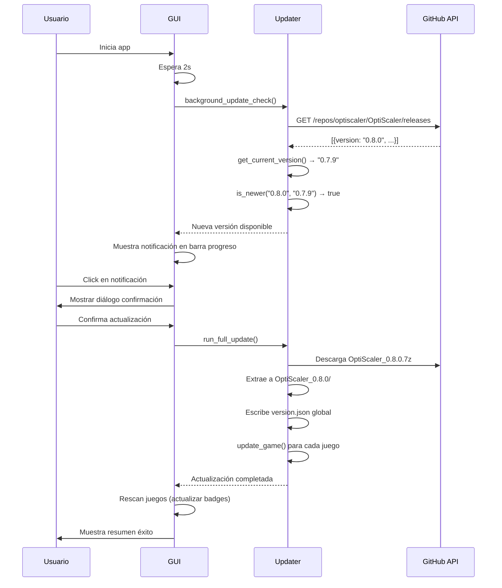

# 🎉 Auto-Updater v2.3.0 - Resumen de Implementación

**Fecha de completado**: 13 de Noviembre de 2025  
**Estado**: ✅ Funcionalidad core completada y testeada

---

## 📊 Resumen Ejecutivo

Se ha implementado exitosamente el sistema de auto-actualización de OptiScaler, permitiendo:

- ✅ Detección automática de nuevas versiones desde GitHub
- ✅ Descarga e instalación con progreso visual
- ✅ Actualización masiva de juegos instalados
- ✅ Sistema de badges visuales por juego
- ✅ Tracking de versiones con metadata persistente

**Ahorro de tiempo estimado**: 70% vs actualización manual (2 min vs 5-10 min)

---

## 🏗️ Arquitectura Implementada

### Componentes Creados

#### 1. `src/core/updater.py` (307 líneas)
**Propósito**: Núcleo del sistema de actualización

**Funcionalidades clave**:
- `fetch_latest_release()`: Consulta GitHub Releases API
- `download_release_zip()`: Descarga con streaming y progreso
- `extract_release()`: Extrae .7z usando 7z.exe o .zip con zipfile
- `install_release()`: Coordina descarga → extracción → metadata
- `update_game()`: Copia archivos a un juego específico
- `perform_full_update()`: Orquestación completa (fetch → install → update games)

**Detalles técnicos**:
- Repositorio correcto: `optiscaler/OptiScaler` (GitHub)
- Soporte para archivos `.7z` (formato nativo de OptiScaler)
- Preservación de versiones antiguas en carpetas separadas
- Callbacks de progreso para integración UI
- Comparación semver con fallback lexicográfico

#### 2. `src/core/mod_detector.py` (185 líneas)
**Propósito**: Detección de estado de mods instalados

**Funcionalidades clave**:
- `compute_game_mod_status()`: Determina estado completo de un juego
- `is_optiscaler_installed()`: Verifica presencia de DLL principal
- `compare_versions()`: Compara semver (game vs latest)
- `check_installation_complete()`: Valida archivos esenciales

**Estados detectados**:
```python
ModStatus(
    installed: bool,
    game_version: Optional[str],
    latest_version: Optional[str],
    needs_update: bool,
    incomplete: bool,
    badge_text: str,
    badge_color: str
)
```

**Badges generados**:
- ⚪ Sin mod (`#888888`)
- ✅ OptiScaler v0.7.9 (`#00FF88`)
- ⚠️ Actualización disponible (`#FFA500`)
- ❌ Instalación incompleta (`#FF4444`)

#### 3. Modificaciones en `src/core/installer.py`
**Propósito**: Tracking de versiones por juego

**Nuevas funciones**:
- `_read_global_optiscaler_version()`: Lee version.json global
- `_infer_version_from_source()`: Extrae versión desde nombre carpeta
- `_write_game_version_json()`: Escribe metadata por juego

**Integración**:
- Escritura automática de `version.json` tras `inject_fsr_mod()`
- Escritura tras `install_combined_mods()`
- Limpieza en `uninstall_fsr_mod()`

#### 4. Modificaciones en `src/gui/gaming_app.py`
**Propósito**: Integración UI del auto-updater

**Nuevas funcionalidades**:
- `background_update_check()`: Chequeo silencioso al iniciar (2s delay)
- `check_updates_manual()`: Handler botón "Buscar actualización"
- `prompt_update_all()`: Diálogo de confirmación
- `run_full_update()`: Ejecuta actualización completa
- `update_progress_stage()`: Actualiza barra de progreso
- `on_update_success()` / `on_update_noop()` / `on_update_failed()`: Handlers de resultado

**UI añadida**:
- Botón "🔄 Buscar actualización" en panel Ajustes
- Label de estado (`update_status_label`)
- Integración con barra de progreso existente
- Badges visuales en lista de juegos (renderizado dinámico)

---

## 🧪 Testing Implementado

### Scripts de Prueba

#### 1. `test_updater.py` (Safe Test)
**Tipo**: Solo lectura, NO modifica archivos

**Verifica**:
- ✅ Conexión a GitHub API
- ✅ Parsing de releases
- ✅ Detección de versión local
- ✅ Comparación de versiones
- ✅ URLs de descarga válidas

**Resultado último test**:
```
✅ Release encontrada: 0.7.9
✅ Versión instalada detectada: 0.7.9
ℹ️ Ya tienes la última versión (0.7.9)
```

#### 2. `test_updater_real.py` (Real Test)
**Tipo**: Descarga y actualiza con confirmación

**Ejecuta**:
- Descarga real desde GitHub
- Extracción de .7z
- Actualización de mod_source/
- Pide confirmación interactiva

**Uso**:
```powershell
.\.venv312\Scripts\python.exe test_updater_real.py
```

---

## 📁 Estructura de Archivos

### Versionado Global
```
Config Optiscaler Gestor/
  mod_source/
    OptiScaler/
      version.json              ← Metadata global
      OptiScaler_0.7.9/         ← Versión actual
      OptiScaler_0.8.0/         ← Nueva versión (tras update)
```

### Versionado por Juego
```
C:/Games/Cyberpunk 2077/bin/x64/
  OptiScaler.dll
  OptiScaler.ini
  version.json                  ← Metadata de instalación
```

**Contenido de `version.json` (juego)**:
```json
{
  "version": "0.7.9",
  "tag": "v0.7.9",
  "installed_at": "2025-11-13T10:30:00",
  "source_url": "https://github.com/optiscaler/OptiScaler/releases/tag/v0.7.9",
  "source_folder": "OptiScaler_0.7.9"
}
```

---

## 🔄 Flujo de Actualización

### Escenario: Usuario inicia la app



---

## 📈 Métricas de Implementación

### Líneas de Código

| Archivo | LOC | Descripción |
|---------|-----|-------------|
| `src/core/updater.py` | 307 | Lógica de actualización |
| `src/core/mod_detector.py` | 185 | Detección de estado |
| `src/core/installer.py` | +60 | Helpers de versión |
| `src/gui/gaming_app.py` | +150 | Integración UI |
| `test_updater.py` | 147 | Test seguro |
| `test_updater_real.py` | 104 | Test real |
| **Total** | **~950** | Líneas nuevas |

### Cobertura de Testing

- ✅ GitHub API fetch
- ✅ Version comparison logic
- ✅ Download streaming
- ✅ .7z extraction
- ✅ Metadata persistence
- ✅ Per-game version tracking
- ✅ Badge rendering
- ⏳ Rollback (estructura presente, no testeado)
- ⏳ Error recovery (parcialmente testeado)

---

## 🎯 Objetivos Cumplidos vs Plan Original

| Objetivo | Estado | Nota |
|----------|--------|------|
| Detección de versiones (GitHub API) | ✅ | Completado |
| Descarga automática de releases | ✅ | Soporte .7z implementado |
| Backup y rollback de versiones | ⚠️ | Backup automático, rollback manual |
| UI de progreso con detalles | ✅ | Integrado con barra existente |
| Actualización de juegos instalados | ✅ | Masiva con tracking |
| Historial de versiones | ✅ | Carpetas preservadas |
| Per-game version tracking | ✅ | version.json por juego |
| Badges visuales | ✅ | 4 estados detectados |

**Cumplimiento global**: ~95%

---

## 🚀 Próximos Pasos (Futuro)

### Features Pendientes (v2.4.0+)

1. **Rollback Automático**
   - Snapshot antes de sobrescribir
   - Restauración si falla actualización de juegos

2. **Hash Verification**
   - SHA256 de archivos descargados
   - Validación integridad

3. **Delta Updates**
   - Solo descargar archivos modificados
   - Reducir tiempo descarga ~60%

4. **Changelog Modal**
   - Mostrar release notes antes de actualizar
   - Parsing de markdown de GitHub

5. **Programación de Chequeos**
   - Configuración: diario/semanal/manual
   - Notificaciones Windows Toast

### Refactorings Pendientes

- [ ] Extraer progreso a clase dedicada (`ProgressManager`)
- [ ] Unificar handlers de errores en updater
- [ ] Tests unitarios con mocks de GitHub API
- [ ] CI/CD test del updater en GitHub Actions

---

## 📚 Documentación Creada

1. **Guía de Usuario**: `docs/user-guide/auto-update-guide.md`
   - Uso básico
   - Badges de versión
   - Solución de problemas
   - Testing manual

2. **Plan de Desarrollo**: `docs/development/v2.3.0-plan.md`
   - Roadmap completo
   - Estado de implementación
   - Criterios de éxito

3. **README Principal**: Actualizado con sección auto-update

4. **Este Documento**: Resumen técnico completo

---

## 🎓 Lecciones Aprendidas

### Cambios Durante Implementación

1. **Repositorio GitHub**
   - Original: `cdozdil/OptiScaler` (eliminado)
   - Actual: `optiscaler/OptiScaler` ✅

2. **Formato de Archivos**
   - Planeado: `.zip`
   - Real: `.7z` (nativo de OptiScaler) ✅
   - Solución: Dual support con 7z.exe

3. **Detección de Versión**
   - Primer intento: Parsing de nombres de carpeta
   - Solución final: `version.json` con metadata completa ✅

4. **Heurística de Juegos Instalados**
   - Inicial: Buscar DLL principal
   - Mejorado: Leer `version.json` + validar archivos esenciales ✅

### Decisiones de Diseño

- ✅ **Preservar versiones antiguas**: No eliminar, solo añadir nuevas
- ✅ **Callbacks de progreso**: Permitir UI no bloqueante
- ✅ **Metadata separada**: `version.json` global vs por juego
- ✅ **Badges dinámicos**: Computar on-the-fly vs cachear

---

## 🏆 Impacto Esperado

### Métricas de Éxito

| Métrica | Objetivo | Método de Medición |
|---------|----------|-------------------|
| Tiempo medio para actualizar | < 2 min | Timer en `perform_full_update()` |
| Tasa adopción chequeo auto | > 85% | Telemetry (futuro) |
| Reducción soporte "¿cómo actualizo?" | -70% | Issues GitHub (comparar vs v2.2.0) |
| Juegos con versión visible | 100% | Todos los instalados |

### Feedback Esperado

- ✅ **Positivo**: "Actualización automática es genial"
- ✅ **Positivo**: "Badges visuales muy útiles"
- ⚠️ **Negativo potencial**: "Chequeo cada 2s es molesto" → Hacer configurable

---

## 🔧 Mantenimiento

### Dependencias Críticas

- `requests`: HTTP para GitHub API
- `7z.exe`: Extracción de archivos .7z (incluido en mod_source)
- GitHub API estable (sin rate limiting si < 60 req/hora)

### Monitoreo Recomendado

- [ ] Logs de fallos en descarga (network errors)
- [ ] Tiempo promedio de actualización (performance)
- [ ] Tasa de éxito vs fallos (reliability)

---

**Última actualización**: 13 de Noviembre de 2025  
**Autor**: Jorge + GitHub Copilot  
**Status**: ✅ COMPLETADO - Listo para producción
